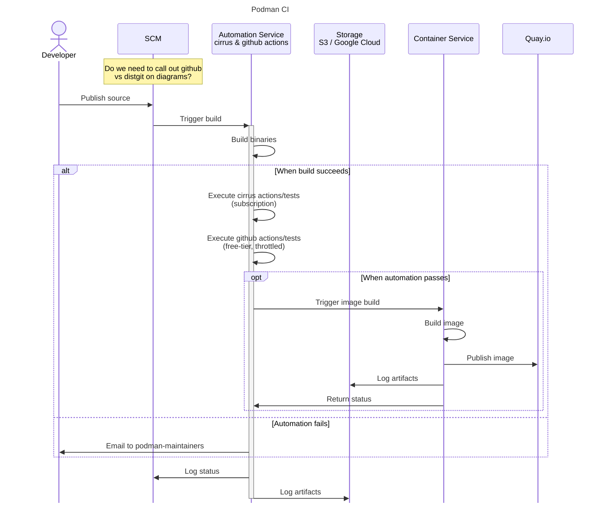

# Podman CI Workflow

#### Last Updated: 2024-01-23

Lorem ipsum dolor sit amet, consectetur adipiscing elit. Quisque tincidunt dolor eu ornare vulputate. Cras tristique leo sed dignissim convallis. Donec id risus sagittis, sodales nisi a, euismod ex. Pellentesque posuere metus dui, ac finibus magna vehicula a. Pellentesque et eleifend nibh. Interdum et malesuada fames ac ante ipsum primis in faucibus. Aliquam semper purus dui, nec ornare purus lobortis eget.

Aliquam fermentum dictum efficitur. Aliquam sodales lectus eu volutpat lacinia. Sed non ullamcorper neque. Ut vitae neque at ex laoreet rhoncus non efficitur mi. Integer laoreet dignissim lorem, quis tristique ante interdum in. Morbi malesuada malesuada quam at tempus. Etiam tempor aliquet interdum.
